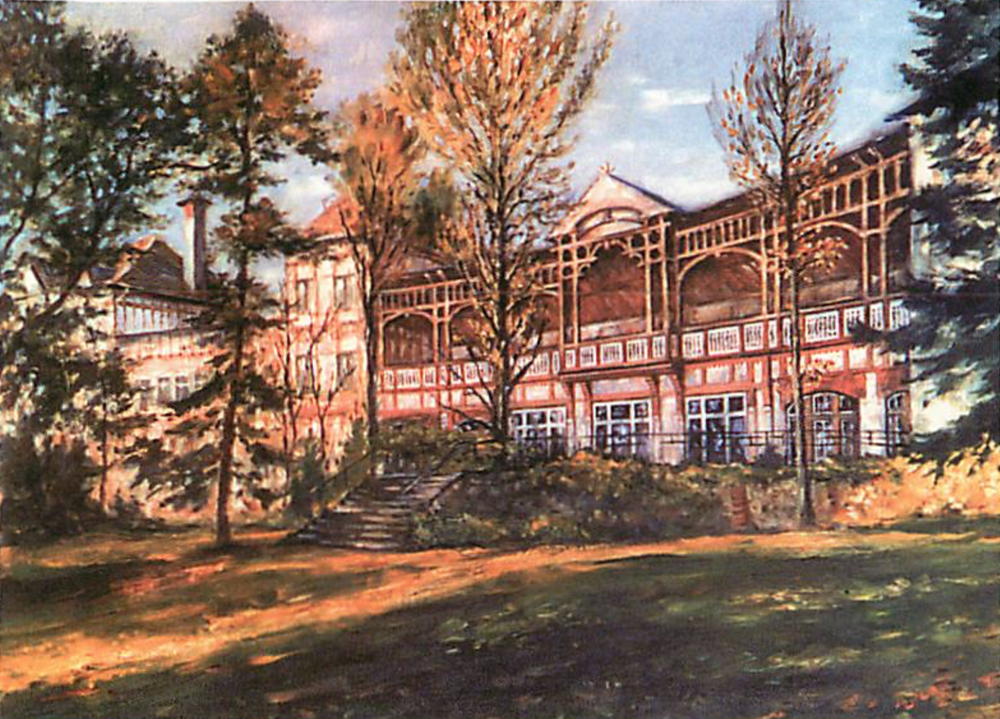

Die Medizinhistorische Sammlung Gommern-Vogelsang e.V. wurde 2002 gegründet. Die Vereinsmitglieder bestehen aus medizinischem und verwaltungstechnischem Krankenhauspersonal, ehemaligen Angestellten und Mitarbeitern, sowie interessierten Laien. Sie haben es sich zur Aufgabe gemacht die Geschichte der Medizin sowie der ehemaligen Heilstätte zu bewahren. Das Anliegen der Medizinhistorischen Sammlung besteht in der Sammlung und Präsentation von Gerätschaften, Literaturbeiträgen, Bilddokumenten und mündlichen Überlieferungen zur wechselvollen Geschichte der ehemaligen Lungenheilstätte für Frauen und Mädchen und der derzeitigen Helios Fachklinik für Rheumatologie, Anästhesie, Orthopädie und Schmerztherapie Gommern-Vogelsang.

Die Ausstellung befindet sich in den Vereinsräumen im Wirtschaftsgebäude unter dem Speisesaal des Fachkrankenhauses und ist über eine Außentreppe zu erreichen.

Öffnungszeiten der Ausstellung: Donnerstag 14.00 Uhr bis 16.00 Uhr.

Für Interessierte ist die Besichtigung auch außerhalb dieser Zeit möglich. Dazu wird um Voranmeldung per E-Mail: VGM.MHS@helios-gesundheit.de gebeten.
